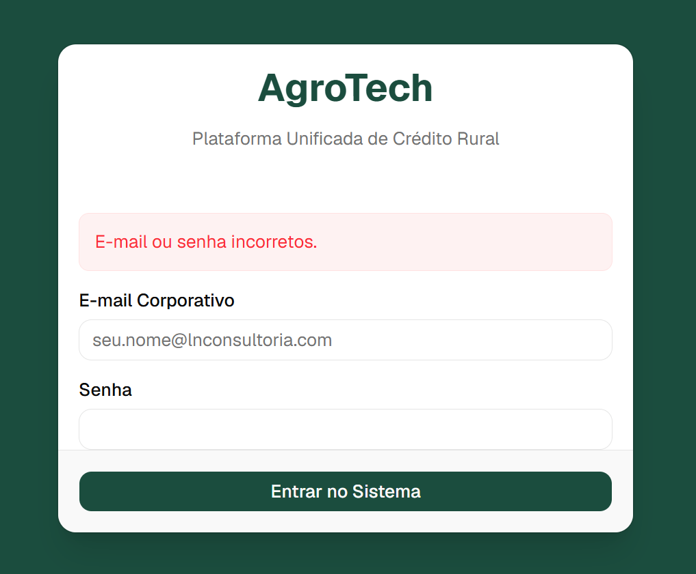

# AgroTech - Plataforma Unificada de Credito Rural

## Sobre o Projeto
AgroTech e uma plataforma SaaS B2B desenhada especificamente para simplificar, automatizar e assegurar todo o fluxo de concessao de credito rural e gestao de agronegocios. A plataforma opera numa arquitetura Multi-Tenant (Multi-Inquilino), o que significa que atende diversas organizacoes, cada uma com as suas proprias filiais, garantindo total isolamento de dados e seguranca.

O objetivo principal e unificar a gestao de produtores, analises zootecnicas, documentacao legal e calculos financeiros, eliminando a fragmentacao de planilhas e a morosidade na criacao de dossies de credito.

## Arquitetura e Tecnologias
- Frontend: Next.js 16 (App Router), React, Tailwind CSS, Shadcn UI.
- Backend/Autenticacao: Supabase (Auth, RLS, Storage) com Renderizacao do Lado do Servidor (SSR).
- Banco de Dados: PostgreSQL gerenciado via Prisma ORM.
- Segurança: Row-Level Security (RLS) no PostgreSQL, garantindo que Administradores e Operadores apenas acedam aos dados da sua propria Organizacao/Filial atraves de injecao de claims em JWT.

## Modulos do Sistema

### 1. Modulo CRM e Cadastro Unico
Gestao centralizada das entidades participantes do ecossistema de credito rural.
- Cadastro de Produtores Rurais (Pessoa Fisica e Pessoa Juridica).
- Validacoes estritas de documentos (CPF/CNPJ).
- Logica de Outorga Uxoria (exigencia de dados do conjuge consoante o estado civil).
- Cadastro de Imoveis Rurais, Benfeitorias e Rebanhos.
- Mapeamento N:M entre Produtores e Propriedades.

### 2. Modulo de Calculo de Credito (ICSD)
Motor financeiro e zootecnico responsavel por ditar a viabilidade do credito rural.
- Extracao e analise de dados da CAF (Pronaf).
- Calculo automatizado de RBO (Receita Bruta Obtida) e RBP (Receita Bruta Projetada).
- Calculo de Custos Operacionais Totais (COT) e Servico da Divida (SD).
- Geracao do Indice de Cobertura do Servico da Divida (ICSD) com classificacao de risco em semaforo (Aprovado, Atencao, Recusado).
- Vinculacao de propostas a linhas do Plano Safra.

### 3. Modulo GED e Heranca Documental
Sistema de Gestao Eletronica de Documentos inteligente e focado no agronegocio.
- Armazenamento em nuvem particionado por Organizacao/Filial.
- Validacao e leitura de metadados de PDFs, imagens e certidoes.
- Motor de Heranca Documental: reaproveitamento de certidoes e documentos validos do ano-safra anterior para a safra atual.
- Alertas automaticos para documentos a vencer (ex: 60 dias antes da expiracao) processados via Cron Jobs.

### 4. Modulo de Automacao Legal e Dossie
Gerador e orquestrador de documentacao final.
- Motor de parser de templates para injecao de variaveis dinamicas.
- Geracao autonoma de Declaracao de Posse Mansa e Pacifica, Capacidade de Apascentamento, Dispensa Ambiental e Marca de Gado.
- Exportacao em PDF/A usando PDF Engine integrada.
- Compilacao do Dossie Unificado: uniao de fichas cadastrais, memoria de calculos, certidoes do GED e declaracoes num unico PDF com sumario e paginacao dinamica.

## Como Executar o Projeto

1. Clone o repositorio.
2. Navegue ate ao diretorio `/project`.
3. Instale as dependencias com `npm install`.
4. Configure as variaveis de ambiente no arquivo `.env.local` (chaves do Supabase e string de conexao do banco).
5. Aplique as migracoes do banco de dados com `npx prisma migrate dev`.
6. Inicie o servidor de desenvolvimento com `npm run dev`.
7. Aceda atraves de `http://localhost:3000`.
